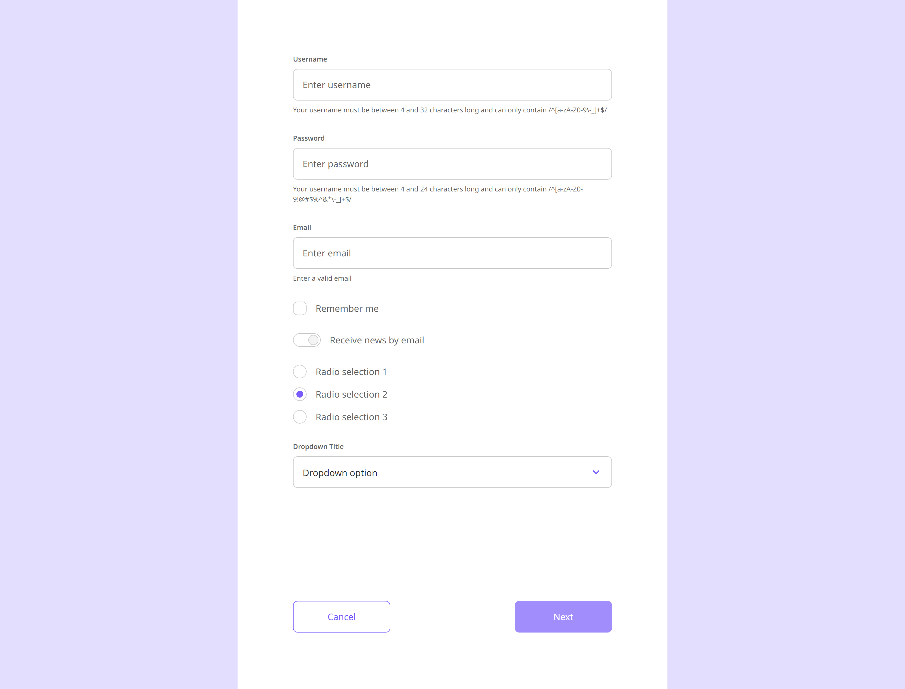

# test-task-frontend-form

## Тестовое задание — форма со стилизованными элементами для ввода данных

### Демо: [https://pryadadev.github.io/test-task-frontend-form](https://pryadadev.github.io/test-task-frontend-form)

### Stack: React, TypeScript, Tailwind, Vite.

### Время выполнения задания — 5 часов 45 минут

### Ограничения:
- Сверстать форму
- Сделать валидацию полей
- По нажатию на кнопку `Next` в `alert` вывести json-объект (который содержит все данные из всех полей ввода)
- Нейминг полей (в json-объекте) соответствует лейблам на макете. Обязательно в camelCase (username, dropdownTitle, radioSelection)
- Кнопка `Next` заблокирована при пустом или невалидном значении полей

### Ход выполнения:
1) Для решения задачи использую подход управляемых компонентов с помощью useState для каждого элемента формы.
2) Сделал компонент со стилизованным `<input>` с возможностью установки своего `label`, `placeholder`, `assistText`, `errorText` и валидацией: по минимальной длине, по максимальной длине и по допустимым символам (с помощью `RegExp`).
3) Сделал кастомные стилизованные компоненты `checkbox`, `toggle`, `radio-selection`, `dropdown-selection`.
4) Сделал поддержку tab-перемещения по элементам и действие по нажатию на `Enter`.
5) Сделал небольшие изменения относительно макета: дополнительные ограничения для `<input>` по длине и допустимым символам.
6) Изменил 3-й `<input>` с "по-умолчанию" на email и `toggle` также.
7) Сделал кнопку `Next` заблокированной при пустых или невалидных значениях полей.
8) Сделал вывод в `alert` JSON-объекта, содержащего все данные из формы.
9) В макете при раскрытом `dropdown` кнопки расположены далеко, поэтому сделал отступ равный по высоте раскрытому `dropdown`, когда `dropdown` не открыт, и равный открытому, когда открыт (да, я знаю, что обычно `dropdown-options` (открытый) является абсолютно позиционируемым).

### P.S.
- Я ранее сталкивался с трудностями или даже невозможностью стилизовать стандартные элементы `checkbox` или `select` из HTML
- Поэтому поначалу колебался с тем, чтобы использовать какую-нибудь библиотеку с готовыми компонентами
- Сначала подумал, что смогу найти библиотеку с точно такими же по стилю компонентами, но не нашёл
- Далее подумал, что стоит использовать библиотеку с нестилизованными компонентами, быстро глянул как такую библиотеку использовать
- Понял, что разобраться в использовании такой библиотеки будет непросто разобраться и что проще будет написать самому кастомные элементы управления (кроме `<input`)
